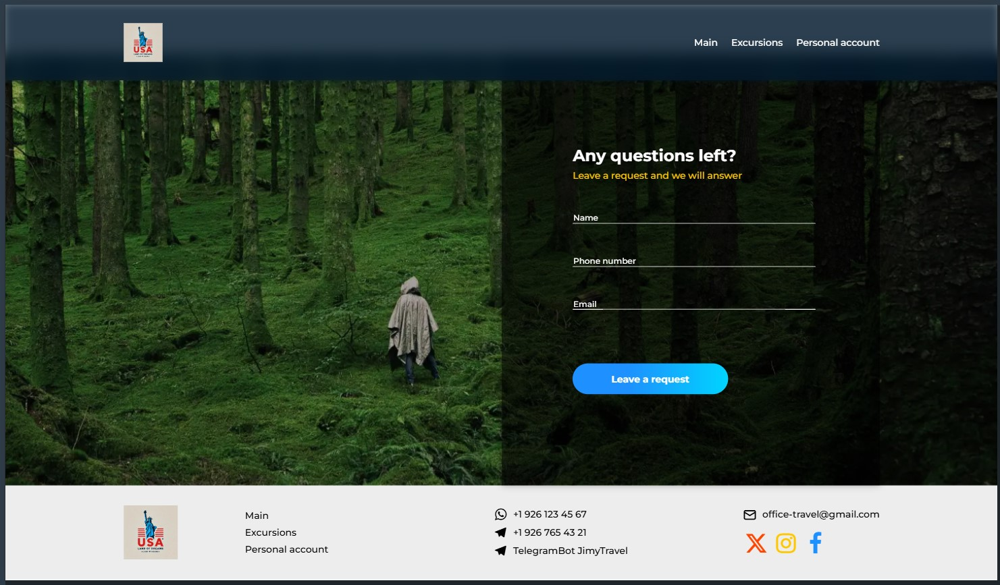
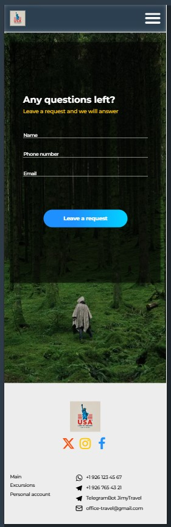

# Travel-site, according to my design

Responsive travel website layout based on my design. Pure HTML, CSS (Flexbox/Grid) and JavaScript for interactive elements — no frameworks.

🔗 **Demo:** https://zhuridochka.github.io/USA_travel-show/excursions.html#excursions

## Screenshots

| Desktop | Mobile |
|---|---|
|  |  |

## What is implemented
- Adaptive for 4 breakpoints (desktop / tablet / mobile / mobile-small)
- Interactive elements in pure JS, without libraries
- Semantic markup, without unnecessary div
- Scroll-animations

## Stack
`HTML5` `CSS3` `JavaScript` · layout - `Figma`
